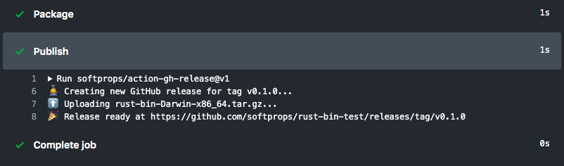

<div align="center">
  📦 :octocat:
</div>
<h1 align="center">
  action gh-release
</h1>

<p align="center">
   A GitHub Action for creating GitHub Releases on Linux, Windows, and macOS virtual environments
</p>

<div align="center">
  
</div>

<div align="center">
  <a href="https://github.com/softprops/action-gh-release/actions">
		
	</a>
</div>

<br />

## 🤸 Usage

### 🚥 Limit releases to pushes to tags

Typically usage of this action involves adding a step to a build that
is gated pushes to git tags. You may find `step.if` field helpful in accomplishing this
as it maximizes the reuse value of your workflow for non-tag pushes.

Below is a simple example of `step.if` tag gating

```yaml
name: Main

on: push

jobs:
  build:
    runs-on: ubuntu-latest
    steps:
      - name: Checkout
        uses: actions/checkout@v2
      - name: Release
        uses: softprops/action-gh-release@v1
        if: startsWith(github.ref, 'refs/tags/')
```

You can also use push config tag filter

```yaml
name: Main

on:
  push:
    tags:
      - "v*.*.*"

jobs:
  build:
    runs-on: ubuntu-latest
    steps:
      - name: Checkout
        uses: actions/checkout@v2
      - name: Release
        uses: softprops/action-gh-release@v1
```

### ⬆️ Uploading release assets

You can configure a number of options for your
GitHub release and all are optional.

A common case for GitHub releases is to upload your binary after its been validated and packaged.
Use the `with.files` input to declare a newline-delimited list of glob expressions matching the files
you wish to upload to GitHub releases. If you'd like you can just list the files by name directly.

Below is an example of uploading a single asset named `Release.txt`

```yaml
name: Main

on: push

jobs:
  build:
    runs-on: ubuntu-latest
    steps:
      - name: Checkout
        uses: actions/checkout@v2
      - name: Build
        run: echo ${{ github.sha }} > Release.txt
      - name: Test
        run: cat Release.txt
      - name: Release
        uses: softprops/action-gh-release@v1
        if: startsWith(github.ref, 'refs/tags/')
        with:
          files: Release.txt
```

Below is an example of uploading more than one asset with a GitHub release

```yaml
name: Main

on: push

jobs:
  build:
    runs-on: ubuntu-latest
    steps:
      - name: Checkout
        uses: actions/checkout@v2
      - name: Build
        run: echo ${{ github.sha }} > Release.txt
      - name: Test
        run: cat Release.txt
      - name: Release
        uses: softprops/action-gh-release@v1
        if: startsWith(github.ref, 'refs/tags/')
        with:
          files: |
            Release.txt
            LICENSE
```

> **⚠️ Note:** Notice the `|` in the yaml syntax above ☝️. That let's you effectively declare a multi-line yaml string. You can learn more about multi-line yaml syntax [here](https://yaml-multiline.info)

### 📝 External release notes

Many systems exist that can help generate release notes for you. This action supports
loading release notes from a path in your repository's build to allow for the flexibility
of using any changelog generator for your releases, including a human 👩‍💻

```yaml
name: Main

on: push

jobs:
  build:
    runs-on: ubuntu-latest
    steps:
      - name: Checkout
        uses: actions/checkout@v2
      - name: Generate Changelog
        run: echo "# Good things have arrived" > ${{ github.workspace }}-CHANGELOG.txt
      - name: Release
        uses: softprops/action-gh-release@v1
        if: startsWith(github.ref, 'refs/tags/')
        with:
          body_path: ${{ github.workspace }}-CHANGELOG.txt
        env:
          GITHUB_REPOSITORY: my_gh_org/my_gh_repo
```

### 💅 Customizing

#### inputs

The following are optional as `step.with` keys

| Name                      | Type    | Description                                                                                         |
| ------------------------- | ------- | --------------------------------------------------------------------------------------------------- |
| `body`                    | String  | Text communicating notable changes in this release                                                  |
| `body_path`               | String  | Path to load text communicating notable changes in this release                                     |
| `draft`                   | Boolean | Indicator of whether or not this release is a draft                                                 |
| `prerelease`              | Boolean | Indicator of whether or not is a prerelease                                                         |
| `files`                   | String  | Newline-delimited globs of paths to assets to upload for release                                    |
| `name`                    | String  | Name of the release. defaults to tag name                                                           |
| `tag_name`                | String  | Name of a tag. defaults to `github.ref`                                                             |
| `fail_on_unmatched_files` | Boolean | Indicator of whether to fail if any of the `files` globs match nothing                              |
| `target_commitish`        | String  | Commitish value that determines where the Git tag is created from. Can be any branch or commit SHA. |
| `token`                   | String  | Secret GitHub Personal Access Token. Defaults to `${{ github.token }}`                              |

💡 When providing a `body` and `body_path` at the same time, `body_path` will be
attempted first, then falling back on `body` if the path can not be read from.

💡 When the release info keys (such as `name`, `body`, `draft`, `prerelease`, etc.)
are not explicitly set and there is already an existing release for the tag, the
release will retain its original info.

#### outputs

The following outputs can be accessed via `${{ steps.<step-id>.outputs }}` from this action

| Name         | Type   | Description                             |
| ------------ | ------ | --------------------------------------- |
| `url`        | String | Github.com URL for the release          |
| `id`         | String | Release ID                              |
| `upload_url` | String | URL for uploading assets to the release |

#### environment variables

The following `step.env` keys are allowed as a fallback but deprecated in favor of using inputs.

| Name                | Description                                                                                |
| ------------------- | ------------------------------------------------------------------------------------------ |
| `GITHUB_TOKEN`      | GITHUB_TOKEN as provided by `secrets`                                                      |
| `GITHUB_REPOSITORY` | Name of a target repository in `<owner>/<repo>` format. defaults to the current repository |

> **⚠️ Note:** This action was previously implemented as a Docker container, limiting its use to GitHub Actions Linux virtual environments only. With recent releases, we now support cross platform usage. You'll need to remove the `docker://` prefix in these versions

Doug Tangren (softprops) 2019
