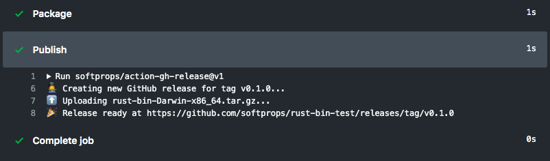

<div align="center">
  📦 :octocat:
</div>
<h1 align="center">
  action gh-release
</h1>

<p align="center">
   A GitHub Action for creating GitHub Releases on Linux, Windows, and macOS virtual environments
</p>

<div align="center">
  
</div>

<div align="center">
  <a href="https://github.com/softprops/action-gh-release/actions">
		
	</a>
</div>

<br />

- [🤸 Usage](#-usage)
  - [🚥 Limit releases to pushes to tags](#-limit-releases-to-pushes-to-tags)
  - [⬆️ Uploading release assets](#️-uploading-release-assets)
  - [📝 External release notes](#-external-release-notes)
  - [💅 Customizing](#-customizing)
    - [inputs](#inputs)
    - [outputs](#outputs)
    - [environment variables](#environment-variables)
  - [Permissions](#permissions)

## 🤸 Usage

### 🚥 Limit releases to pushes to tags

Typically usage of this action involves adding a step to a build that
is gated pushes to git tags. You may find `step.if` field helpful in accomplishing this
as it maximizes the reuse value of your workflow for non-tag pushes.

Below is a simple example of `step.if` tag gating

```yaml
name: Main

on: push

jobs:
  build:
    runs-on: ubuntu-latest
    steps:
      - name: Checkout
        uses: actions/checkout@v6
      - name: Release
        uses: softprops/action-gh-release@v2
        if: github.ref_type == 'tag'
```

You can also use push config tag filter

```yaml
name: Main

on:
  push:
    tags:
      - "v*.*.*"

jobs:
  build:
    runs-on: ubuntu-latest
    steps:
      - name: Checkout
        uses: actions/checkout@v6
      - name: Release
        uses: softprops/action-gh-release@v2
```

### ⬆️ Uploading release assets

You can configure a number of options for your
GitHub release and all are optional.

A common case for GitHub releases is to upload your binary after its been validated and packaged.
Use the `with.files` input to declare a newline-delimited list of glob expressions matching the files
you wish to upload to GitHub releases. If you'd like you can just list the files by name directly.
If a tag already has a GitHub release, the existing release will be updated with the release assets.

Below is an example of uploading a single asset named `Release.txt`

```yaml
name: Main

on: push

jobs:
  build:
    runs-on: ubuntu-latest
    steps:
      - name: Checkout
        uses: actions/checkout@v6
      - name: Build
        run: echo ${{ github.sha }} > Release.txt
      - name: Test
        run: cat Release.txt
      - name: Release
        uses: softprops/action-gh-release@v2
        if: github.ref_type == 'tag'
        with:
          files: Release.txt
```

Below is an example of uploading more than one asset with a GitHub release

```yaml
name: Main

on: push

jobs:
  build:
    runs-on: ubuntu-latest
    steps:
      - name: Checkout
        uses: actions/checkout@v6
      - name: Build
        run: echo ${{ github.sha }} > Release.txt
      - name: Test
        run: cat Release.txt
      - name: Release
        uses: softprops/action-gh-release@v2
        if: github.ref_type == 'tag'
        with:
          files: |
            Release.txt
            LICENSE
```

> **⚠️ Note:** Notice the `|` in the yaml syntax above ☝️. That lets you effectively declare a multi-line yaml string. You can learn more about multi-line yaml syntax [here](https://yaml-multiline.info)

> **⚠️ Note for Windows:** Both `\` and `/` path separators are accepted in `files` globs. If you need to match a literal glob metacharacter such as `[` or `]`, keep escaping the metacharacter itself in the pattern.

If your release assets are generated under a subdirectory, set `working_directory`
and keep the `files` patterns relative to that directory.

```yaml
- name: Release
  uses: softprops/action-gh-release@v2
  if: github.ref_type == 'tag'
  with:
    working_directory: dist
    files: |
      Release.txt
      checksums/*.txt
```

### 📝 External release notes

Many systems exist that can help generate release notes for you. This action supports
loading release notes from a path in your repository's build to allow for the flexibility
of using any changelog generator for your releases, including a human 👩‍💻

```yaml
name: Main

on: push

jobs:
  build:
    runs-on: ubuntu-latest
    steps:
      - name: Checkout
        uses: actions/checkout@v6
      - name: Generate Changelog
        run: echo "# Good things have arrived" > ${{ github.workspace }}-CHANGELOG.txt
      - name: Release
        uses: softprops/action-gh-release@v2
        if: github.ref_type == 'tag'
        with:
          body_path: ${{ github.workspace }}-CHANGELOG.txt
          repository: my_gh_org/my_gh_repo
          # note you'll typically need to create a personal access token
          # with permissions to create releases in the other repo.
          # A non-empty explicit token overrides GITHUB_TOKEN.
          # Omit the input to use github.token; passing "" treats the token as unset.
          token: ${{ secrets.CUSTOM_GITHUB_TOKEN }}
```

When you use GitHub's built-in `generate_release_notes` support, you can optionally
pin the comparison base explicitly with `previous_tag`. This is useful when the default
comparison range does not match the release series you want to publish.

```yaml
- name: Release
  uses: softprops/action-gh-release@v2
  with:
    tag_name: stage-2026-03-15
    target_commitish: ${{ github.sha }}
    previous_tag: prod-2026-03-01
    generate_release_notes: true
```

### 💅 Customizing

#### inputs

The following are optional as `step.with` keys

| Name                       | Type    | Description                                                                                                                                                                                                                                                                                                                                                                                                                                     |
| -------------------------- | ------- | ----------------------------------------------------------------------------------------------------------------------------------------------------------------------------------------------------------------------------------------------------------------------------------------------------------------------------------------------------------------------------------------------------------------------------------------------- |
| `body`                     | String  | Text communicating notable changes in this release                                                                                                                                                                                                                                                                                                                                                                                              |
| `body_path`                | String  | Path to load text communicating notable changes in this release                                                                                                                                                                                                                                                                                                                                                                                 |
| `draft`                    | Boolean | Keep the release as a draft. Defaults to false. When reusing an existing draft release, set this to true to keep it draft; omit it to publish after upload.                                                                                                                                                                                                                                                                                 |
| `prerelease`               | Boolean | Indicator of whether or not is a prerelease                                                                                                                                                                                                                                                                                                                                                                                                     |
| `preserve_order`           | Boolean | Upload assets sequentially in the provided order. This controls the action's upload behavior, but it does not control the final asset ordering that GitHub may display on the release page or return from the Releases API.                                                                                                                                                                                                                 |
| `files`                    | String  | Newline-delimited globs of paths to assets to upload for release. Escape glob metacharacters when you need to match a literal filename that contains them, such as `[` or `]`. `~/...` expands to the runner home directory. On Windows, both `\` and `/` separators are accepted. GitHub may normalize raw asset filenames that contain special characters; the action restores the asset label when possible, but the final download name remains GitHub-controlled. |
| `working_directory`        | String  | Base directory to resolve `files` globs against. Use this when release assets live under a subdirectory. If omitted, the action resolves `files` from `${{ github.workspace }}`.                                                                                                                                                                                                                                                          |
| `overwrite_files`          | Boolean | Indicator of whether files should be overwritten when they already exist. Defaults to true                                                                                                                                                                                                                                                                                                                                                      |
| `name`                     | String  | Name of the release. defaults to tag name                                                                                                                                                                                                                                                                                                                                                                                                       |
| `tag_name`                 | String  | Name of a tag. defaults to `github.ref_name`. `refs/tags/<name>` values are normalized to `<name>`.                                                                                                                                                                                                                                                                                                                                                |
| `fail_on_unmatched_files`  | Boolean | Indicator of whether to fail if any of the `files` globs match nothing                                                                                                                                                                                                                                                                                                                                                                          |
| `repository`               | String  | Name of a target repository in `<owner>/<repo>` format. Defaults to GITHUB_REPOSITORY env variable                                                                                                                                                                                                                                                                                                                                              |
| `target_commitish`         | String  | Commitish value that determines where the Git tag is created from. Can be any branch or commit SHA. Defaults to repository default branch. When creating a new tag for an older commit, `github.token` may not have permission to create the ref; use a PAT or another token with sufficient contents permissions if you hit `403 Resource not accessible by integration`.                                                                 |
| `token`                    | String  | Authorized GitHub token or PAT. Defaults to `${{ github.token }}` when omitted. A non-empty explicit token overrides `GITHUB_TOKEN`. Passing `""` treats the token as explicitly unset, so omit the input entirely or use an expression such as `${{ inputs.token || github.token }}` when wrapping this action in a composite action.                                                                                                                                                  |
| `discussion_category_name` | String  | If specified, a discussion of the specified category is created and linked to the release. The value must be a category that already exists in the repository. For more information, see ["Managing categories for discussions in your repository."](https://docs.github.com/en/discussions/managing-discussions-for-your-community/managing-categories-for-discussions-in-your-repository)                                                     |
| `generate_release_notes`   | Boolean | Whether to automatically generate the name and body for this release. If name is specified, the specified name will be used; otherwise, a name will be automatically generated. If body is specified, the body will be pre-pended to the automatically generated notes. See the [GitHub docs for this feature](https://docs.github.com/en/repositories/releasing-projects-on-github/automatically-generated-release-notes) for more information |
| `previous_tag`             | String  | Optional. When `generate_release_notes` is enabled, use this tag as GitHub's `previous_tag_name` comparison base. If omitted, GitHub chooses the comparison base automatically.                                                                                                                                                                                                               |
| `append_body`              | Boolean | Append to existing body instead of overwriting it                                                                                                                                                                                                                                                                                                                                                                                               |
| `make_latest`              | String  | Specifies whether this release should be set as the latest release for the repository. Drafts and prereleases cannot be set as latest. Can be `true`, `false`, or `legacy`. Uses GitHub api defaults if not provided                                                                                                                                                                                                                            |

💡 When providing a `body` and `body_path` at the same time, `body_path` will be
attempted first, then falling back on `body` if the path can not be read from.

💡 When the release info keys (such as `name`, `body`, `prerelease`, etc.) are not
explicitly set and there is already an existing release for the tag, the release
will retain its original info.

💡 Draft status is handled separately during finalization. If the action reuses an
existing draft release, set `draft: true` to keep it draft; if `draft` is omitted,
the action will publish that draft after uploading assets.

💡 `files` is glob-based, so literal filenames that contain glob metacharacters such as
`[` or `]` must be escaped in the pattern.

💡 GitHub may normalize or rewrite uploaded asset filenames that contain special or
non-ASCII characters. This action uploads the requested file, but it cannot force the
final asset name that GitHub stores or returns from the Releases API. In particular,
4-byte Unicode characters such as emoji cannot currently be restored via asset labels.

#### outputs

The following outputs can be accessed via `${{ steps.<step-id>.outputs }}` from this action

| Name         | Type   | Description                                                                                                                                                                               |
| ------------ | ------ | ----------------------------------------------------------------------------------------------------------------------------------------------------------------------------------------- |
| `url`        | String | Github.com URL for the release                                                                                                                                                            |
| `id`         | String | Release ID                                                                                                                                                                                |
| `upload_url` | String | URL for uploading assets to the release                                                                                                                                                   |
| `assets`     | String | JSON array containing information about each updated (newly uploaded or overwritten) asset, in the format given [here](https://docs.github.com/en/rest/releases/assets#get-a-release-asset) (minus the `uploader` field) |

As an example, you can use `${{ fromJSON(steps.<step-id>.outputs.assets)[0].browser_download_url }}` to get the download URL of the first asset.

#### environment variables

The following `step.env` keys are allowed as a fallback but deprecated in favor of using inputs.

| Name                | Description                                                                                |
| ------------------- | ------------------------------------------------------------------------------------------ |
| `GITHUB_TOKEN`      | GITHUB_TOKEN as provided by `secrets`                                                      |
| `GITHUB_REPOSITORY` | Name of a target repository in `<owner>/<repo>` format. defaults to the current repository |

> **⚠️ Note:** This action was previously implemented as a Docker container, limiting its use to GitHub Actions Linux virtual environments only. With recent releases, we now support cross platform usage. You'll need to remove the `docker://` prefix in these versions

### Permissions

This Action requires the following permissions on the GitHub integration token:

```yaml
permissions:
  contents: write
```

When used with `discussion_category_name`, additional permission is needed:

```yaml
permissions:
  contents: write
  discussions: write
```

[GitHub token permissions](https://docs.github.com/en/actions/security-guides/automatic-token-authentication#permissions-for-the-github_token) can be set for an individual job, workflow, or for Actions as a whole.

Note that if you intend to run workflows on the release event (`on: { release: { types: [published] } }`), you need to use
a personal access token for this action, as the [default `secrets.GITHUB_TOKEN` does not trigger another workflow](https://github.com/actions/create-release/issues/71).

Doug Tangren (softprops) 2019
